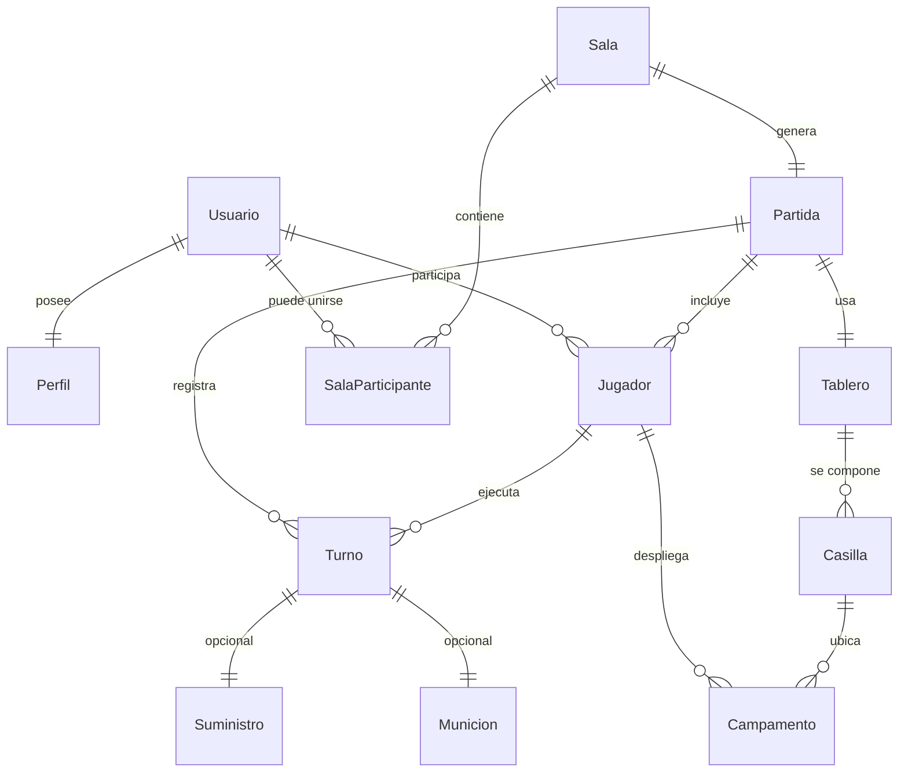

# Modelo de Datos

## Entidades destacadas

- **SalaParticipante**: nuevo modelo que registra jugadores y espectadores en una
  sala antes de iniciar la partida. El campo `slot` diferencia los cupos de
  jugador (1 o 2).
- **Partida**: se amplió con los campos `id_jugador_en_turno`, `estado_subfase`,
  `respuesta_activa`, `id_jugador_pendiente_respuesta`, `ganador_id` y `empate`
  para almacenar el flujo completo de la partida y la lógica de respuesta.
- **Jugador**: ahora persiste contadores de pólvora, destrucciones y estado del
  Suministro de Emergencia (`se_usos_totales`, `se_cooldown_turnos`,
  `domo_activo`, etc.). También se guardan los turnos procesados para calcular
  la generación automática de pólvora y el control de inactividad.
- **Campamento**: incluye `ultimo_turno_reloc` para validar la restricción del
  evento RELOC.
- **Turno**: guarda `tipo_accion` y un `resultado` JSONB con un snapshot del
  turno, incluyendo munición disparada, impactos, campamentos destruidos y
  estado resultante de la partida.

Cada migración relacionada se encuentra bajo `src/migrations`, incluyendo la
creación de la nueva tabla `SalaParticipantes` y la ampliación de `Partidas`,
`Jugadores`, `Campamentos` y `Turnos`.
